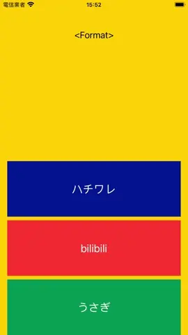

# WWImageFormat

[](https://developer.apple.com/swift/) [](https://developer.apple.com/swift/)  [](https://developer.apple.com/swift/) [](https://developer.apple.com/swift/)

## [Introduction - 簡介](https://swiftpackageindex.com/William-Weng)
- [Simply analyze the commonly used image data formats.](https://github.com/MROS/jpeg_tutorial)
- [簡單地分析常用的圖片資料格式。](https://realnewbie.com/coding/basic-concent/jpg-png-apng-gif-svg/)



### [Installation with Swift Package Manager](https://medium.com/彼得潘的-swift-ios-app-開發問題解答集/使用-spm-安裝第三方套件-xcode-11-新功能-2c4ffcf85b4b)
```
dependencies: [
    .package(url: "https://github.com/William-Weng/WWImageFormat.git", .upToNextMajor(from: "1.0.1"))
]
```

## [可用函式](https://ezgif.com/video-to-webp)
|函式|說明|
|-|-|
|parseFormat(_:)|解析圖片格式|
|parseData(_:)|解析圖片格式 + 是否為動畫|

## [Example](https://ezgif.com/video-to-webp)
```swift
import UIKit
import WWImageFormat

final class ViewController: UIViewController {

    @IBOutlet weak var formatLabel: UILabel!
    @IBOutlet weak var imageView: UIImageView!
    
    private let images = ["ハチワレ.jpg", "bilibili.gif", "うさぎ.png"]
    
    @IBAction func parseImageFormat(_ sender: UIButton) {
        
        guard let url = Bundle.main.url(forResource: images[sender.tag], withExtension: nil),
              let imageData = try? Data.init(contentsOf: url),
              let format = WWImageFormat.shared.parseData(imageData)
        else {
            return
        }
        
        imageView.image = UIImage(data: imageData)
        formatLabel.text = "format: \(format.format), isAnimated: \(format.isAnimated)"
    }
}
```
